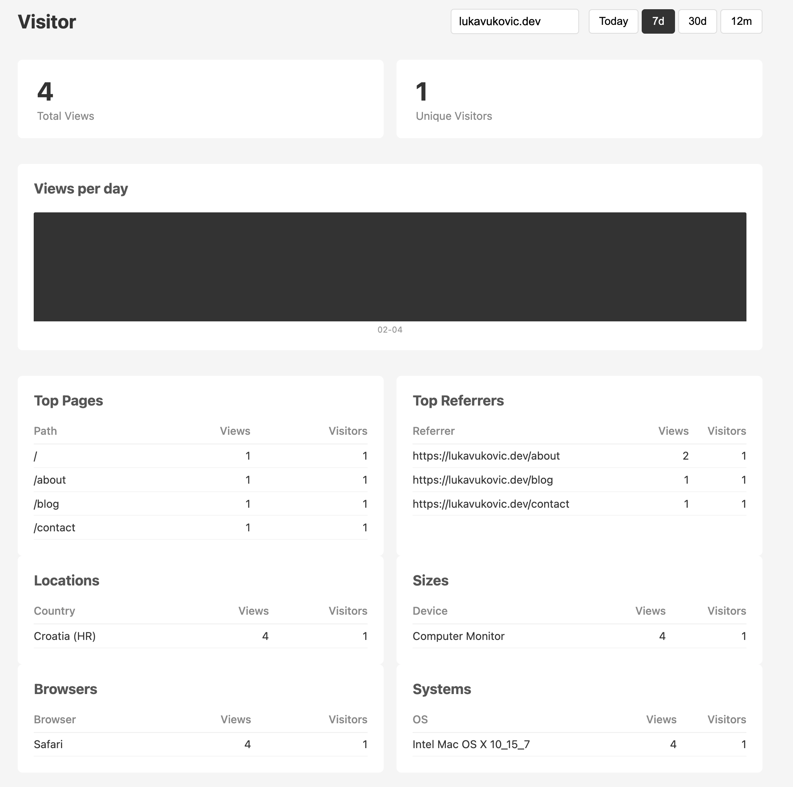

# Visitor - Analytics SaaS Tool

Visitor is personal analytics tool for my [website](https://lukavukovic.dev).
The idea behind Visitor was to have my own simple analytics tool which would collect some data that is interesting to me. Just to see if anyone visits the website, which blog is most popular, where are readers located and similar.

# Building docker image

`docker build --platform linux/amd64 -t fra.ocir.io/<namespace>/visitor:latest .`

`docker push fra.ocir.io/<namespace>/visitor:latest`
